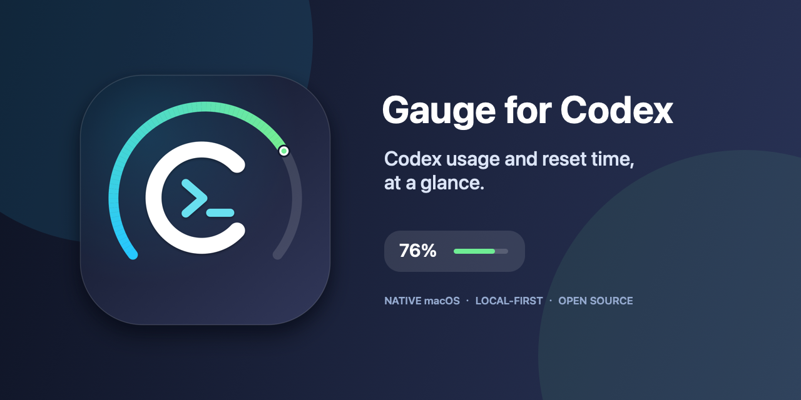
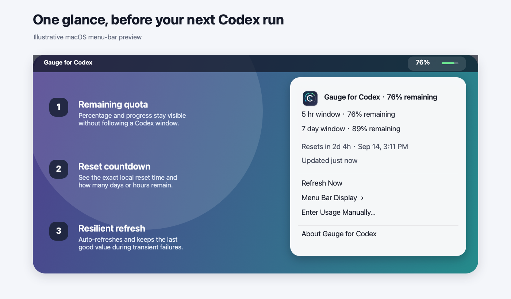
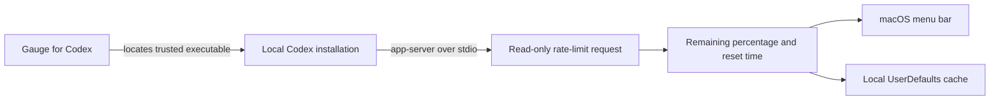

# Gauge for Codex

Language: English · [简体中文](README.zh-Hans.md)

> Unofficial third-party utility. Not affiliated with or endorsed by OpenAI.



See Codex usage, reset time, and remaining quota at a glance from the macOS menu bar.

Native macOS · Local-first · Lightweight · Open source · English / 简体中文 / 日本語 / Español

**Website:** [gauge-for-codex.r9rgtcrw5g.chatgpt.site](https://gauge-for-codex.r9rgtcrw5g.chatgpt.site) · **Download:** [Latest release](https://github.com/qingtan-labs/GaugeForCodex/releases/latest)

## Preview



The screenshot is an illustrative preview. Percentages and reset times shown by the running app come from the Codex installation and account on your Mac.

The original icon combines a geometric **C** for Codex compatibility, a **`>_`** terminal prompt for local coding work, and a progress halo for remaining quota. It deliberately does not copy or modify OpenAI artwork.

## Highlights

- Keeps the remaining percentage and a slim progress bar visible in the menu bar.
- Shows every available usage window and focuses on the most constrained one.
- Displays both a localized countdown and the exact reset time in your time zone.
- Refreshes at launch, every 60 seconds, when the Mac wakes, and after a reset.
- Preserves the last successful value during transient failures and marks stale data.
- Includes a percentage-only compact mode and a manual fallback.
- Runs natively on Apple silicon and Intel Macs without Electron.
- Contains no analytics, advertising, account system, or telemetry.

## Requirements

- macOS 12 Monterey or later.
- Codex or the ChatGPT desktop app installed and signed in, or a signed-in Codex CLI available in a standard location.
- Xcode Command Line Tools only when building from source.

## Download

The latest Universal 2 DMG and ZIP are available from [GitHub Releases](https://github.com/qingtan-labs/GaugeForCodex/releases/latest). SHA-256 checksums are attached to every release.

Public builds are currently ad-hoc signed and not Apple-notarized. On first launch, Control-click the app in Applications and choose **Open**. Never disable Gatekeeper.

## Install from source

```bash
git clone https://github.com/qingtan-labs/GaugeForCodex.git
cd GaugeForCodex/quota-overlay
./install.sh
```

The installer builds a Universal 2 app, installs it to `~/Applications/Gauge for Codex.app`, and registers a per-user LaunchAgent. It also disables the earlier local `CodexGauge` login item when present, without deleting it.

To build without installing:

```bash
cd quota-overlay
./build.sh
```

The app will be written to `quota-overlay/build/Gauge for Codex.app`.

## Optional launcher

The non-resident launcher is useful for a Finder shortcut or a manually configured Login Item. It starts the existing LaunchAgent when available and otherwise opens the app directly.

```bash
cd launcher
./build.sh
```

## How it works



Gauge for Codex starts the `codex app-server --stdio` executable and requests `account/rateLimits/read`. It does not execute prompts or read conversation content. This is a local integration boundary rather than a documented stable public API, so a future Codex update may require an adapter update.

## Privacy

Gauge for Codex does not operate an external service and does not send telemetry. It stores only normalized usage percentages, reset timestamps, display preferences, and the last successful refresh time in macOS UserDefaults. The Codex component may communicate with OpenAI using the account already configured on your Mac. See [PRIVACY.md](PRIVACY.md).

## Security and support

- [Security policy](SECURITY.md)
- [Support](SUPPORT.md)
- [Contributing](CONTRIBUTING.md)
- [Changelog](CHANGELOG.md)

## License and trademarks

The source code and original Gauge for Codex artwork are available under the [MIT License](LICENSE).

Codex, ChatGPT, OpenAI, and their respective marks are trademarks of OpenAI. This project uses the word “Codex” only to describe compatibility. Its icon is original artwork and does not include the OpenAI or Codex logo. See [NOTICE.md](NOTICE.md).
