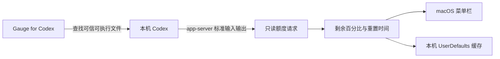

# Gauge for Codex

语言：[English](README.md) · 简体中文

> 非官方第三方工具，与 OpenAI 没有隶属、合作或背书关系。


在 macOS 菜单栏随时查看 Codex 剩余额度、重置时间和剩余天数。

原生 macOS · 本地优先 · 轻量 · 开源 · English / 简体中文 / 日本語 / Español

**产品官网：** [qingtan-labs.github.io/GaugeForCodex](https://qingtan-labs.github.io/GaugeForCodex/) · **下载：** [最新版本](https://github.com/qingtan-labs/GaugeForCodex/releases/latest)

## 界面预览


图片是功能示意图。实际运行时显示的百分比与重置时间，来自这台 Mac 上的 Codex 安装及当前登录账号。

原创图标由三层语义组成：几何 **C** 代表 Codex 兼容关系，**`>_`** 代表本机编码与命令行，外层进度环代表剩余额度；它没有复制或修改 OpenAI 官方图形。

## 主要功能

- 在菜单栏持续显示剩余百分比和细进度条。
- 列出所有可用额度周期，并优先展示剩余最少的一档。
- 同时显示本地化倒计时、剩余天数和当前时区的准确重置时间。
- 启动时、每 60 秒、Mac 唤醒后和额度重置后自动同步。
- 临时同步失败时保留最后一次成功值，并明确标记过期数据。
- 提供“仅百分比”紧凑模式和手动填写后备方案。
- 原生支持 Apple Silicon 与 Intel Mac，不使用 Electron。
- 不包含分析、广告、账号系统或遥测。

## 使用要求

- macOS 12 Monterey 或更高版本。
- 已安装并登录 Codex 或 ChatGPT 桌面应用；也支持标准路径下已登录的 Codex CLI。
- 只有从源码构建时才需要 Xcode Command Line Tools。

## 下载

最新版 Universal 2 DMG 与 ZIP 可从 [GitHub Releases](https://github.com/qingtan-labs/GaugeForCodex/releases/latest) 下载；每个版本都会附带 SHA-256 校验值。

公开构建目前采用临时签名，尚未经过 Apple 公证。首次启动时，请在“应用程序”中按住 Control 点击应用并选择“打开”；不要关闭 Gatekeeper。

## 从源码安装

```bash
git clone https://github.com/qingtan-labs/GaugeForCodex.git
cd GaugeForCodex/quota-overlay
./install.sh
```

安装脚本会构建 Universal 2 应用，将其安装到 `~/Applications/Gauge for Codex.app`，并注册当前用户的 LaunchAgent。如果检测到早期本地版 `CodexGauge`，脚本会停用其登录启动项，但不会删除旧文件。

只构建、不安装：

```bash
cd quota-overlay
./build.sh
```

产物位于 `quota-overlay/build/Gauge for Codex.app`。

## 可选启动器

不驻留的启动器适合制作 Finder 快捷方式，或由用户自行加入“登录项”。它会优先唤起已有 LaunchAgent，失败时再直接打开主应用。

```bash
cd launcher
./build.sh
```

## 工作方式



Gauge for Codex 会短暂启动 `codex app-server --stdio`，请求 `account/rateLimits/read`。它不会执行提示词，也不会读取聊天内容。这是本机集成接口，并非公开稳定 API；未来 Codex 更新后可能需要适配。

## 隐私

Gauge for Codex 不运营外部服务，也不发送遥测。程序只在 macOS UserDefaults 中保存归一化后的额度百分比、重置时间戳、显示偏好和最后成功同步时间。Codex 组件可能使用你已在本机配置的账号与 OpenAI 通信。详见 [PRIVACY.md](PRIVACY.md)。

## 项目文档

- [安全策略](SECURITY.md)
- [支持](SUPPORT.md)
- [参与贡献](CONTRIBUTING.md)
- [更新记录](CHANGELOG.md)

## 许可证与商标

源码和 Gauge for Codex 原创图形采用 [MIT License](LICENSE)。

Codex、ChatGPT、OpenAI 及其相关标志属于 OpenAI。本项目仅使用“Codex”一词说明兼容关系；应用图标是原创设计，不包含 OpenAI 或 Codex 官方标志。详见 [NOTICE.md](NOTICE.md)。
